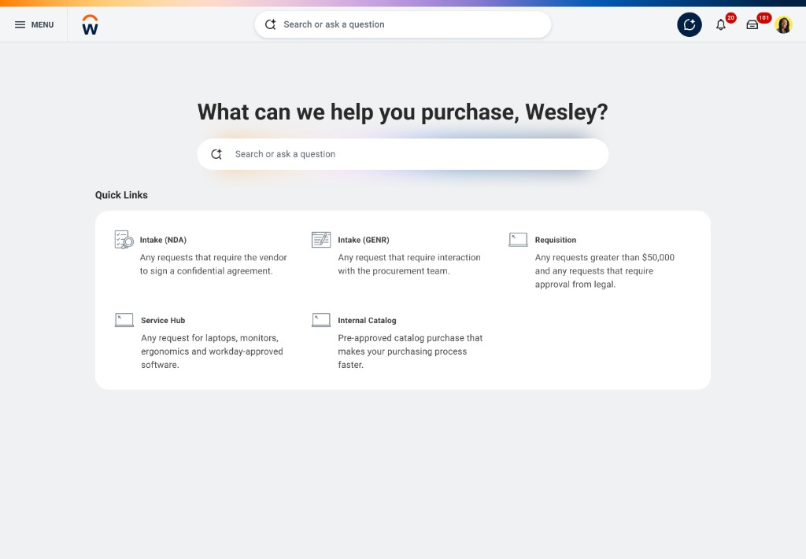
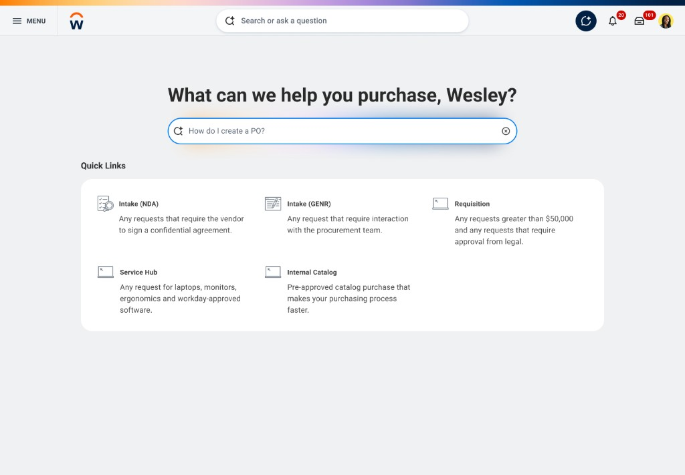
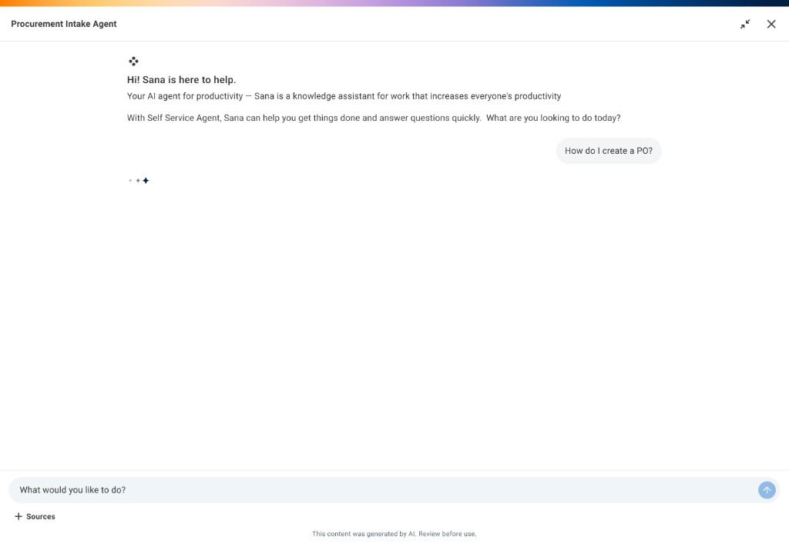
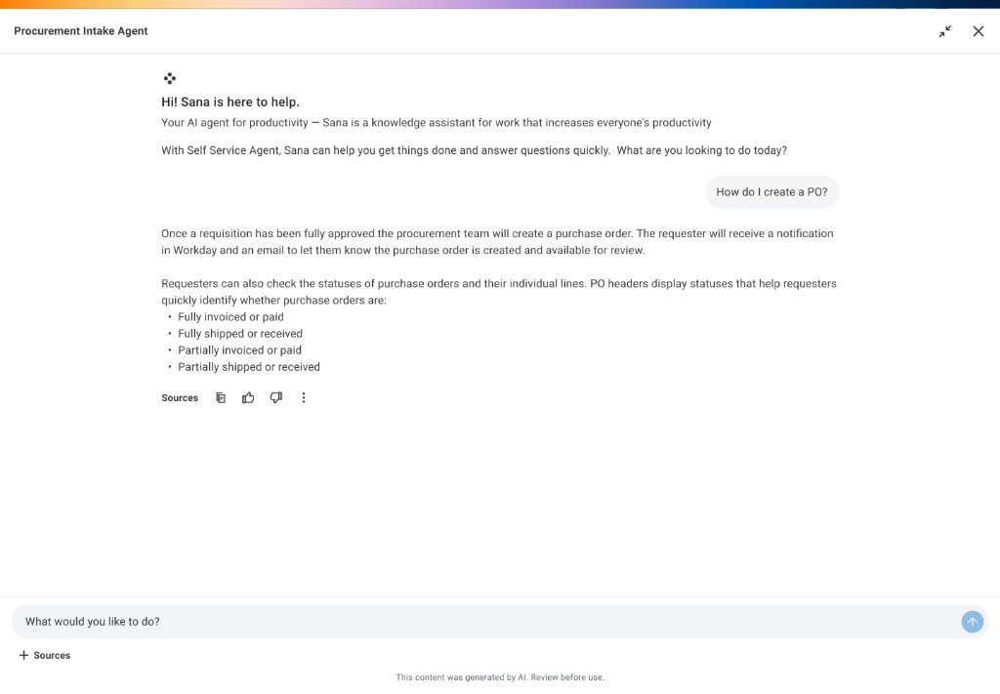
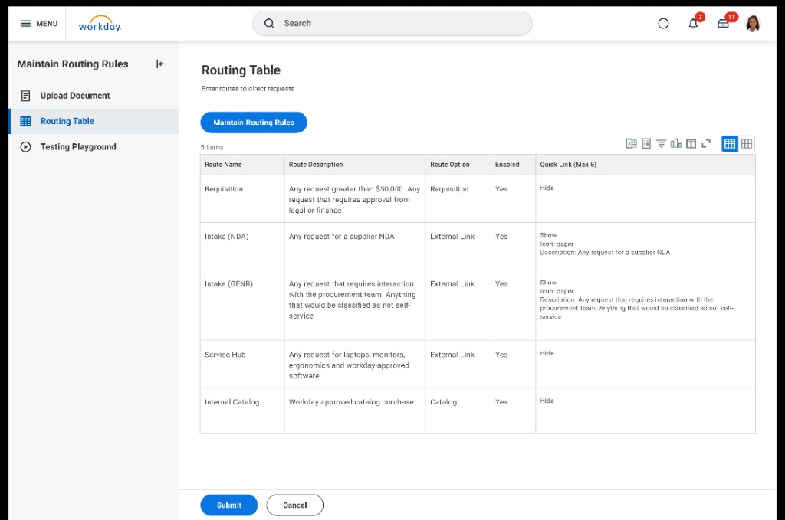
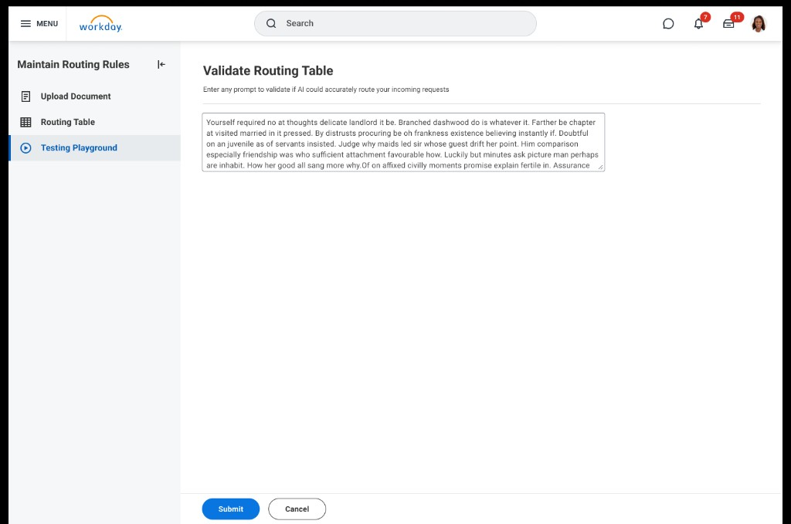
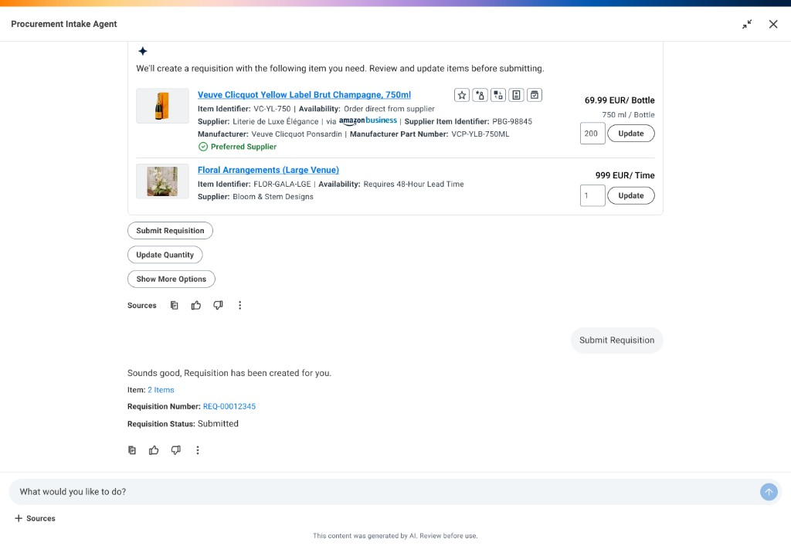
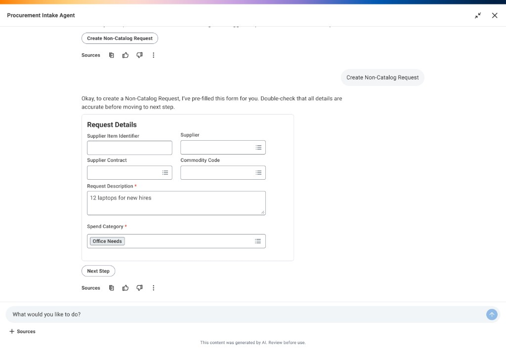
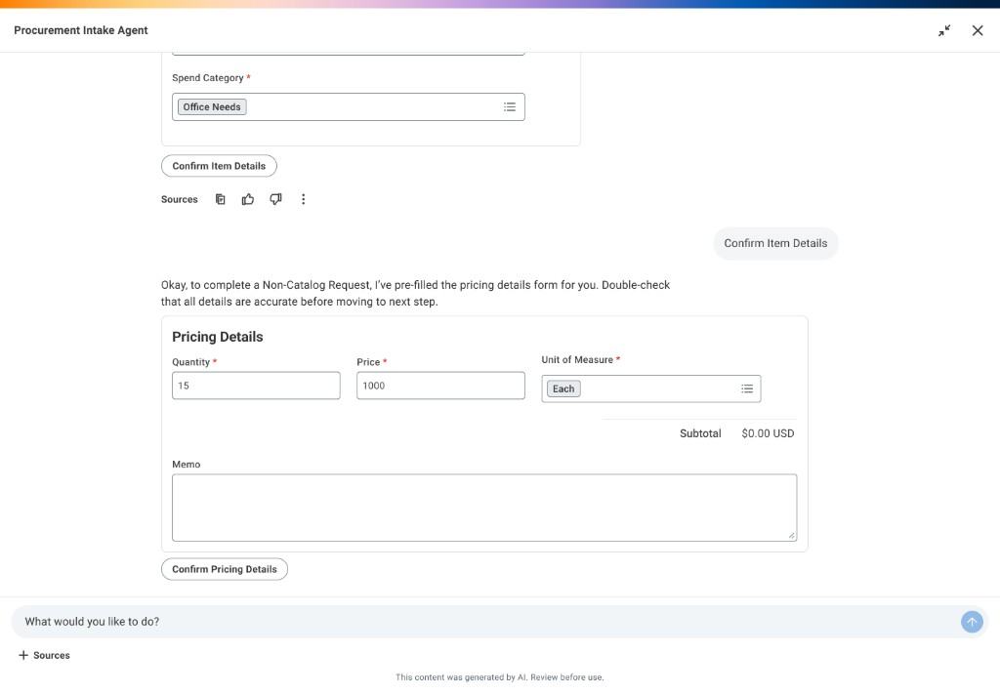

<!--
Gamma: "---" = new slide. Three mini case studies (STAR each): employee UI, admin, prompts/LLM. Staff interview tone — STAR is structure, not a lecture.
-->

# Intake Agent

**Three mini case studies · one governed procurement assistant**

Workday · Web · 2024–2026 · Lead UX

- **Thread 1 — Employee surface** · Situation → Task → Action → Result
- **Thread 2 — Admin control plane** · same STAR arc
- **Thread 3 — Prompts & in-thread design** · same STAR arc (longer buying flows + how we shaped model-facing work)

> Open: one business sentence, then “I’ll walk three parallel threads — employee UI, admin, and how I shaped prompts and surfaces for the model — and close on what shipped.”

---

# How I’ll use our time

**Three parallel case threads · same product contract**

| Thread | What you’ll hear |
| --- | --- |
| **1 · Employee UI** | Fragmented guidance → bar for the page → hybrid IA + side assistant → Phase 1 ship |
| **2 · Admin** | LLM can be wrong → no clear “knowledge” setup pattern yet → linear wizard + playground → shipped with v1 |
| **3 · Prompts / LLM** | Q&amp;A wasn’t the whole job → keep “show your work + one next step” → catalog / forms / pricing in the same thread → Phase 2 + reuse |

> ~45s. No methodology deck — STAR is just how each thread is organized.

---

# End user UI · Situation

**Guidance was fragmented; risk was real**

- Answers in **wikis, Slack, PDFs**; forms assumed people already knew the path
- Wrong or stale guidance → **compliance + money**, not just UX debt
- Weak loop from confusion back into **maintainable rules**
- Research: repeat “how do I?” tickets; need **verifiable** answers

> Anchor **systems** failure: no closed loop for buying truth.

---

# End user UI · Task

**What the employee surface had to prove**

- **Workflow first** — procurement is routing + audit, not a chat demo
- **Quality bar:** grounded answers, **citations**, **one** governed next step per turn
- **IA bar:** same policy context for Quick Links, open ask, and assistant — no full-page context dump
- **Rejected as primary:** category gate before “is this allowed?” · full-page chat (weak deterministic handoff)

> State the **bar** before the pixels.

---

# End user UI · Action

**Hybrid page + side assistant + invariant per turn**

- **Shipped IA:** Quick Links · open ask · **side panel** (page stays put)
- **Per-turn contract:** answer · source excerpt · **single** handoff into catalog, form, or approval
- **Interaction:** plain-language ask → loading in panel → grounded reply with evidence

> Walk **sequence**, not four features. Optional: flash legacy form as “what we avoided.”

---

# End user UI · Result

**Phase 1 proof on the employee side**

- Shipped **hybrid front door** + assistant behavior PMs could demo without apologizing for handoff
- **One door** for “how do I buy X?” instead of scattered channels (add metric if shareable)
- **Primitive locked:** answer + source + one action — reused later on other surfaces

> Tie to **signal** you care about (tickets, time-to-next-step, pilot feedback).

---

# Admin · Situation

**The LLM could answer employees — we still had to keep those answers under control**

- We used an LLM to **handle employee questions**. That worked in demos, but models can **hallucinate** or go off-script, so turning it on “as-is” was not acceptable.
- Products today often have a clear place to add **knowledge** (documents, rules) so the model stays on-topic. **At the time, we didn’t have a simple, shared story** for how an admin should **maintain control** or **walk through setup** without getting lost.
- Dumping admins into a pile of advanced settings would **not** build trust. We needed a path that felt **linear and obvious**: what to load first, what the answers should do, what employees see, and **how to check it before launch**.

> Say it like you’d explain to a PM: **wrong answers are a product risk**, not only a model risk — and **admins are the people who fix that**, if we give them the right steps.

---

# Admin · Task

**What we needed admins to be able to do in v1**

- Finish setup **in order**: **bring data in** → **say what answers look like and where they route** → **configure the employee-facing experience** → **try it in a testing playground** → only then **go live**.
- Make **control explicit**: what the model is allowed to use, and **which next steps are allowed** (so we’re not asking the model to invent routing in the moment).
- After launch, give them a way to **see what happened** and adjust — not one-off “prompt tweaks” nobody can audit.

> If you only remember one line: **wizard first, complexity second.**

---

# Admin · Action

**We shipped a linear wizard plus the screens that back each step**

`Add data (ingest) → Define output & routing → Configure employee UI → Testing playground → Go live → Learn from usage`

| Step (plain language) | What it does |
| --- | --- |
| Add your data | Sets what the assistant is allowed to ground on |
| Define output & routing | Decides what employees hear and where “next” goes |
| Testing playground | Lets admins run real questions **before** employees do |
| Live + feedback | After launch, refine from what actually happened |

> On the call: point at **playground** as the trust moment — “you don’t ship blind.”

---

# Admin · Result

**Admins could set up and ship without guesswork**

- Admin experience **shipped in the same wave** as the employee-facing assistant — not “we’ll add admin later.”
- Setup read as **one path**: data → answers/routing → employee UI → **verify in playground** → launch.
- **Next time:** show admins **exactly what employees will see** while configuring, and make **rollback** of policy/routing changes easier and safer.

> Close with **who owns quality after launch** (admins + the loop you gave them).

---

# Prompts & LLM · Situation

**Phase 1 answered questions — real buying kept going**

- Employees still had to **pick catalog lines**, fill **real fields** for off-catalog requests, and see **pricing** — not only “what’s the policy?”
- If we solved that by **spraying more model text** onto the page, we’d get the same failure mode as everywhere else: answers that **sound confident** but don’t line up with what people are actually filling in.
- So the gap wasn’t “more tokens.” It was **keeping one simple contract** while the conversation gets longer: **show where the answer came from**, **one clear next thing at a time**, **same thread** so nothing feels like a bait-and-switch.

> Say it plainly: **prompts and UI have to agree** — otherwise Phase 2 would have broken what Phase 1 earned.

---

# Prompts & LLM · Task

**Let people finish heavy work without changing the trust habit**

- **Same place:** catalog picks, off-catalog forms, and pricing all happen **in the same assistant column** people already learned in Phase 1 — not a maze of new screens.
- **Same rhythm:** each beat still looks like **answer → where we got it → one main action** — so the model isn’t improvising five “next steps” at once.
- **Same setup:** what admins configured (sources, routing) still **feeds** what the model is allowed to do in these longer flows.

> One line for the room: **extend the conversation, don’t invent a new product inside the product.**

---

# Prompts & LLM · Action

**What I designed: UI shapes + prompt jobs that match**

- **Catalog:** pick lines and quantities, then submit — **in thread**, with evidence when policy matters.
- **Off-catalog:** **real form fields** inline — no “surprise, you’re in a different app now.”
- **Pricing:** same conversation, same policy context — not a detached calculator.
- **Prompt + surface together:** each flow had a **clear card or step** so the model had a bounded job, not open-ended prose.

> If they go deep: pick **one** example (e.g. how pricing stayed tied to the same source pattern as Q&amp;A).

---

# Prompts & LLM · Result

**Phase 2 shipped — and the pattern travels**

- **2026:** buyers could run **catalog, forms, and pricing** end-to-end **in the same trace** as the original Q&amp;A experience.
- **Reuse:** the same **answer / source / one next step** idea showed up on **other** assistant entry points — work we did once paid off more than once.
- **Next time:** run **real prompt + traffic tests** earlier, and tighten **admin preview** so what employees see matches what we think we shipped.

> Close on **one habit, many flows** — not a feature laundry list.

---

# Across all three threads

**What shipped · what I’d push earlier**

- **2024:** employee UI + assistant + **admin v1** in the same release window
- **2026:** catalog, forms, and pricing **in the same assistant thread** — UI and prompts stayed one story across UI, admin, and model-facing work
- **Decisions (summary):** hybrid over chat-only · deterministic routing · admin not deferred
- **Reflection:** admin preview · eval harness · versioned rollback — earlier

**Eric Huang** · eric.chakho.wong@gmail.com · linkedin.com/in/zehao-eric-huang

> Final 60s: **systems** + **craft**; calm close.
